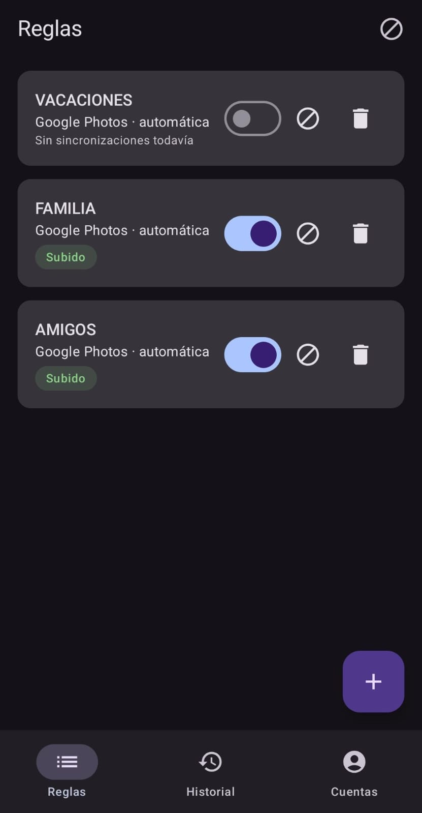
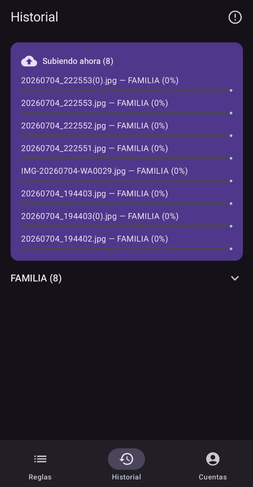

# Baul

[](https://github.com/santiagojorda/Baul/actions/workflows/coverage.yml)
[](https://codecov.io/github/santiagojorda/Baul)
[](https://kotlinlang.org)
[](app/build.gradle.kts)

Baul is a native Android app that watches folders in your gallery and automatically uploads new photos and videos to the destination you configure — Google Photos or Google Drive — then deletes the local original once the upload is confirmed. No Tasker, no third-party automation, no manual exports.

Instead of one fixed integration, Baul is built around configurable **rules**: each rule maps a folder to a destination with its own metadata (privacy, album, target folder, tags) and its own Google account, so you can run several rules at once — for example, a phone camera folder syncing to a private Google Photos album while a separate folder syncs to a specific Drive directory.

Google Photos' own auto-backup only does one thing: send everything to Google Photos, on one active account, and leave the originals on the phone until you manually free up space. Baul isn't a gallery or a Google Photos replacement — it's the automation layer on top that decides where each folder's files go, and cleans up after itself once they're safely uploaded.

### Example: splitting vacation photos between friends

Say you just got back from a trip with a few friends, and everyone only wants *their* photos — not the 800 photos of the whole group's cameras combined. Instead of manually picking through the gallery and sending each person their subset one by one:

1. Create a folder per friend (`Fotos Juan`, `Fotos Maria`, ...) and sort the relevant shots into each.
2. Make one rule per folder, each pointing at its own private Google Photos album.
3. Share each album with just that one friend.

Drop photos into any of those folders later and only that friend's album gets the new files — the other rules don't touch them, and you're not stuck re-doing this by hand for every future trip.

<p align="center">
  
  
</p>

## Features

- **Rule-based auto-sync** — pick a folder via the system picker (SAF) and route it to Google Photos or Drive, each with destination-specific metadata. It doesn't have to be `DCIM/Camera` (the default camera folder on phones like Samsung Galaxy) — any folder the system picker can browse works, so you can point a rule at a screenshots folder, a WhatsApp media folder, or any other folder you pick by hand.
- **Multi-account support** — connect more than one Google account and assign a different account per rule.
- **Real-time detection** — a `ContentObserver` on `MediaStore` picks up new files as soon as they land in a watched folder, no polling.
- **Resilient background uploads** — `WorkManager` handles uploads with retry/backoff, survives process death, and respects a Wi-Fi-only setting per rule.
- **Safe delete** — the original file is only removed (via `MediaStore.createDeleteRequest`) after the destination API confirms the upload succeeded. With the optional "All files access" permission granted, it deletes directly instead of prompting the system confirmation dialog every time.
- **Upload history** — a log of every processed file with its status (uploaded, error, pending/retrying) grouped by folder, with manual retry/cancel per file. A separate **Logs** view lists every file with a recorded error across all folders, so a transient failure doesn't stay hidden while it retries on its own.
- **Home screen widget** — a single-row Glance widget with the sync status at a glance, no need to open the app: an orange badge for files still queued or uploading, red for failed ones, and blue for files already uploaded but still waiting on the delete confirmation, or just "✓ Todo sincronizado" when there's nothing left to do. Tapping the row opens the app; a small ↻ button re-triggers a scan by hand (useful right after the app was killed, before the periodic 15-minute scan would've caught it on its own).
- **Clip editor** — trim and concatenate clips from a folder into a single highlight video (via Media3 Transformer), which can then feed into a sync rule like any other output folder.

## Tech stack

- Kotlin + Jetpack Compose, MVVM with domain/data separation
- Room for rules and upload history persistence
- WorkManager for background uploads
- Google Sign-In (`GoogleSignInClient` + `GoogleAuthUtil`) for OAuth, multi-account — chosen over Credential Manager, which can't refresh a token from a background Worker without an Activity
- Official Google client library for Drive (resumable uploads)
- Photos Library API (`photoslibrary.appendonly` scope) for Google Photos
- Media3 Transformer for clip trimming/concatenation
- Kover for coverage, reported to Codecov via GitHub Actions

## Getting started

```bash
git clone https://github.com/santiagojorda/Baul.git
cd Baul
./gradlew assembleDebug
```

Requires JDK 17. Open the project in Android Studio or run tests from the CLI:

```bash
./gradlew testDebugUnitTest
```

The app builds and the UI runs right away, but **Google sign-in won't work until you set up your own OAuth client** — the SHA-1 + package name registered in Google Cloud Console are tied to a specific signing certificate, and `release.jks`/`keystore.properties` are gitignored on purpose (nobody else's build can reuse the original author's OAuth credentials). There's no secret file to copy; it's config on your own Google Cloud project. See **[docs/oauth-setup.md](docs/oauth-setup.md)** for the one-time, per-developer walkthrough (~5 minutes).

## Development shortcuts

A `Makefile` wraps the common Gradle/adb commands for testing and installing on a USB-connected device:

```bash
make test        # run unit tests (testDebugUnitTest)
make devices     # list phones connected over USB (adb devices -l)
make install     # build and install the debug build on the connected phone
make uninstall   # uninstall the app from the phone (asks for confirmation — wipes rules/history/Google accounts)
make reinstall   # uninstall + install (use this if adb reports INSTALL_FAILED_UPDATE_INCOMPATIBLE)
make apk         # build the debug APK (app/build/outputs/apk/debug/app-debug.apk)
make apk-release # build the release APK — signed if keystore.properties exists (see keystore.properties.example), unsigned otherwise
make logs        # tail logcat filtered to Baul on the connected phone (Ctrl+C to stop)
```

`JAVA_HOME` and `ANDROID_HOME` default to `~/.jdks/jdk-17.0.19+10` and `~/Android/Sdk`; override either with `make install JAVA_HOME=/path/to/jdk-17` if yours live elsewhere.

## Privacy Policy

[santiagojorda.github.io/Baul/privacy-policy.html](https://santiagojorda.github.io/Baul/privacy-policy.html)

## License

MIT — see [LICENSE](LICENSE).
